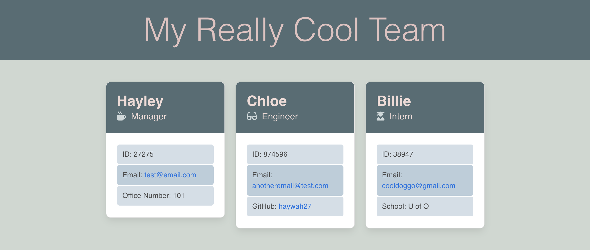
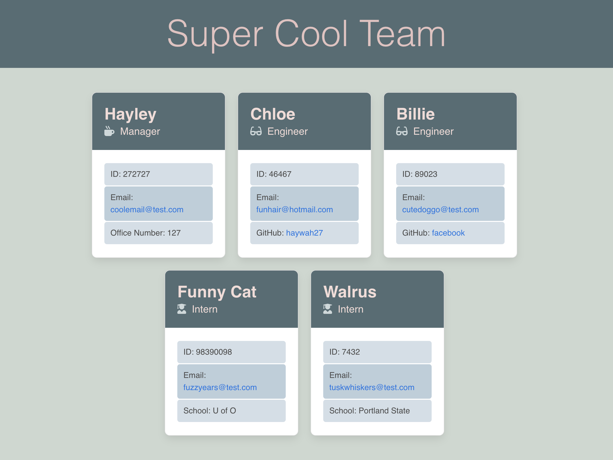

# Team-Profile-Generator

## Description
This is a Node.js command-line application that takes in information (from a user) about employees on a software engineering team. The user can enter information about three different types of employees: a Manager, Engineer, Intern. Each type of employee are constructors stemmed from a parent constructor to demonstrate extension of classes. After information is entered, a writeFile function using fs generates an HTML webpage that displays summaries for each person on seperate cards. 

Behind the scenes, there are multiple suites of jest unit tests for each employee function to demonstrate code maintenance.

## Walkthrough
Watch this [tutorial video](https://drive.google.com/file/d/14TxCwkL7nQv4S4g3CKincyOW3zHf_vHU/view) for a deep look at how to develop a new team profile page.

## Tests
After installing jest (npm i jest) use the command "npm run test" to envoke 4 test suites consisting of 31 jest tests. All 31 currently pass.

## Example Outputs
Sample 1: 

Sample 2: 

