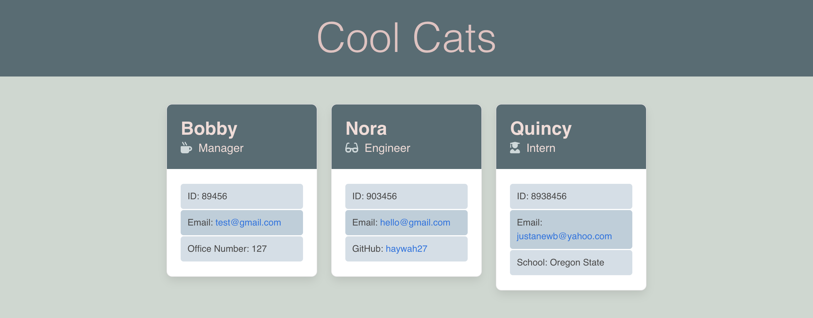

# Team-Profile-Generator

## Description
This is a Node.js command-line application that takes in information (from a user) about employees on a software engineering team. The user can enter information about three different types of employees: a Manager, Engineer, Intern. Each type of employee are constructors stemmed from a parent constructor to demonstrate extension of classes. After information is entered, a writeFile function using fs generates an HTML webpage that displays summaries for each person on seperate cards. 

Behind the scenes, there are multiple suites of jest unit tests for each employee function to demonstrate code maintenance.

## Usage
### Using the integrated terminal do the following to set up and initiate program:
* Open an integrated terminal on index.js
* Install Jest and Inquire packages with the command "npm i"
* To run program, input “node index.js” and follow the prompt messages. 
* Navigate to generated html file with the name "index.html" and open in browser to see new team profile.

## Walkthrough
Watch this [tutorial video](https://drive.google.com/file/d/1i69ZoiULqPkucTAYvZfBTAe6vN_FEch9/view) for a deep look at how to develop a new team profile page as well as a demonstration of a command line invocation of Jest tests.

## Tests
Use the command "npm run test" to envoke 4 test suites consisting of 31 jest tests. All 31 currently pass. (*if you have not installed dependencies, do so with "npm i jest" in the command line*)

## Example Outputs
Sample 1: 

Sample 2: 

